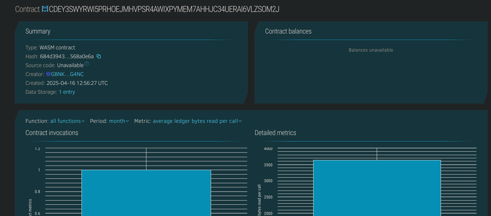

# Order Fulfillment Verifier

## 📌 Project Title
**Order Fulfillment Verifier**

---

## 📄 Project Description
Order Fulfillment Verifier is a Soroban-based smart contract that helps e-commerce platforms or logistics services record, track, and verify the fulfillment of customer orders on-chain. Each order has a unique ID and fulfillment status.

---

## 🎯 Project Vision
The project aims to introduce transparency and immutability to the order lifecycle, reducing disputes between sellers and buyers by verifying the fulfillment status in a tamper-proof manner on the Stellar blockchain.

---

## 🚀 Key Features
- 🆕 Register new product orders with buyer details
- ✅ Verify and mark orders as fulfilled
- 🔍 View real-time order status
- 🧾 Immutable order history and fulfillment timestamps
- 🔐 On-chain proof of fulfillment and buyer identity

---

## 🔮 Future Scope
- 📦 Integrate with logistics APIs for automatic status updates
- 🖼 Attach delivery confirmation documents or images via IPFS
- 📲 Connect to frontend apps or dashboards
- ⚖ Enable dispute resolution modules
- 🌍 Multi-vendor or marketplace-level fulfillment tracking

## Contract Details
CDEY3SWYRWI5PRHOEJMHVPSR4AWIXPYMEM7AHHJC34UERAI6VLZSOM2J
